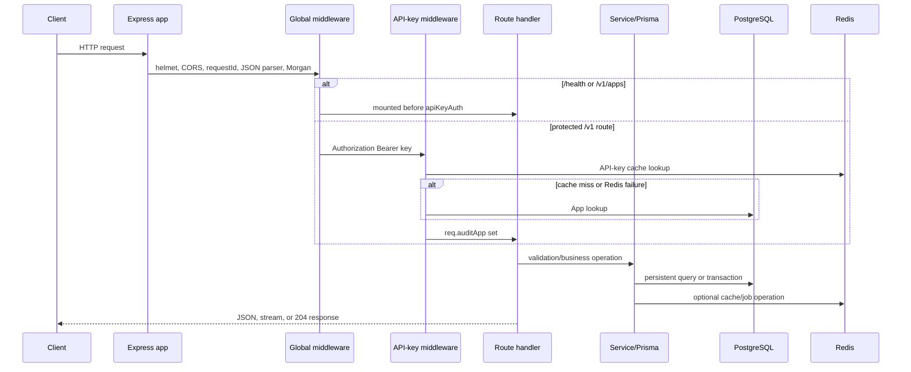
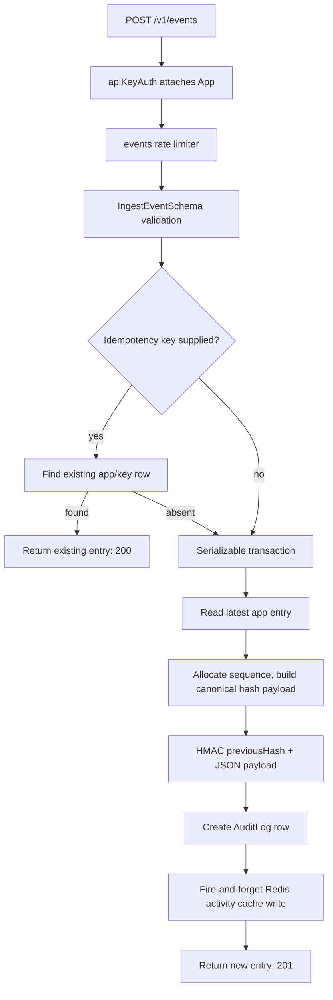
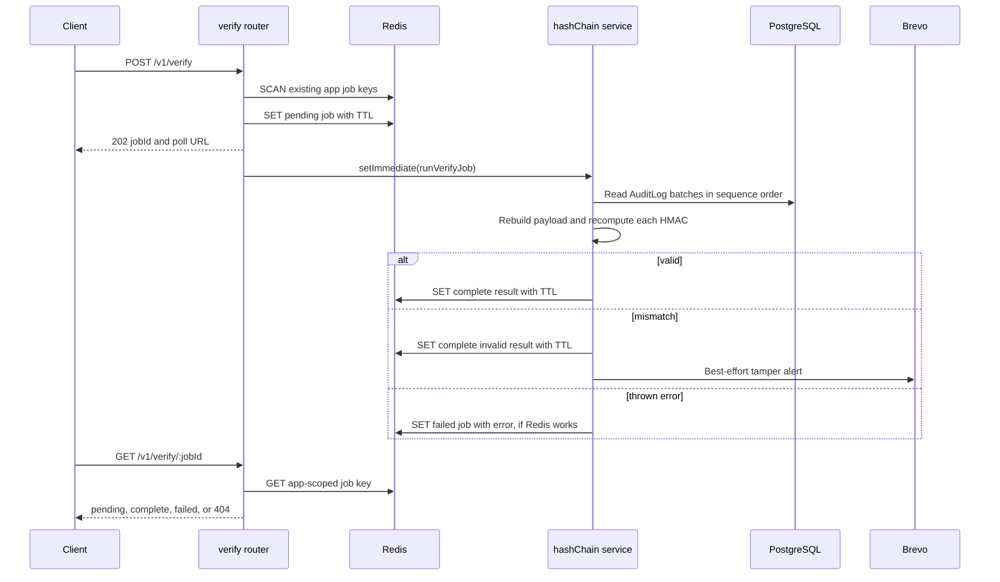

# Audit Log Service backend architecture

## Scope and source of truth

This document describes the current backend implementation only: `src/`, its
Prisma schema and migrations, and runtime configuration that the backend reads.
It intentionally excludes the dashboard, tests, Docker, and deployment setup.
The current source code is authoritative. `AuditLog_MasterContext.md` was used
only to clarify terminology; statements that conflict with code are not treated
as current behavior.

## Project overview

The service accepts audit events from registered applications, stores them in
PostgreSQL, links each app's events into an HMAC-SHA256 hash chain, and exposes
search, export, resource activity, and on-demand chain-verification APIs. It
also manages application API keys through a separate internal-dashboard API.

The backend owns HTTP handling, authentication, validation, sequence allocation,
hash-chain construction and verification, storage, Redis-backed temporary data,
email-alert attempts, request logging, and graceful shutdown. It does not have
controllers as a separate layer: route handlers call Prisma and services
directly.

The central domain concepts are:

| Concept | Current representation and role |
|---|---|
| Application | An `App` database row. It owns a per-app event chain and API key. |
| API key | A raw `als_...` bearer credential returned once at creation/rotation; `App.apiKey` stores only its HMAC-SHA256 digest. |
| Audit event / log entry | An `AuditLog` row containing actor, action, resource, optional metadata/network fields, chain fields, and a per-app sequence number. |
| Genesis hash | `GENESIS_HASH`, used as `previousHash` for an app's first entry. |
| Hash chain | Each entry HMACs its defined payload together with its predecessor's hash. The next entry depends on the prior entry's stored hash. |
| Canonicalization | Recursive sorting of metadata object keys before metadata enters the hash payload. Arrays retain their order, but objects inside arrays are canonicalized. |
| Idempotency key | An optional client token stored on `AuditLog`. It scopes duplicate detection to one app. |
| Verification job | A Redis JSON object that represents an in-process scan started by `POST /v1/verify`. |

`ipAddress`, `userAgent`, and `idempotencyKey` are stored on an audit row but
are **not** fields of `HashPayload`. The HMAC verification logic therefore does
not itself detect changes to those three fields; the PostgreSQL append-only
trigger is the ordinary-write protection for the row as a whole. See
[data integrity](DATA_STORAGE.md#integrity-and-physical-schema-state).

## Components and relationships

```mermaid
flowchart LR
  Client[API client] --> Express[Express app]
  Express --> Global[Helmet / CORS / request ID / JSON parser / Morgan]
  Global --> Apps[/v1/apps router]
  Global --> ApiAuth[apiKeyAuth]
  ApiAuth --> EventRoutes[/v1/events routers]
  ApiAuth --> VerifyRoutes[/v1/verify router]
  ApiAuth --> ExportRoute[/v1/export router]
  Apps --> Prisma[Prisma client]
  EventRoutes --> Hash[hashChain service]
  EventRoutes --> Activity[activityCache service]
  VerifyRoutes --> Hash
  VerifyRoutes --> Alerts[alert service]
  Hash --> Prisma
  Activity --> Redis[(Redis)]
  ApiAuth --> Redis
  ApiAuth --> Prisma
  Apps --> Prisma
  ExportRoute --> Prisma
  Prisma --> Postgres[(PostgreSQL)]
  Alerts --> Brevo[Brevo HTTP API]
```

### Express application and route ownership

`createApp()` in `src/app.ts` constructs an Express application. It mounts
`/health` first, then `/v1/apps`, then the per-app authentication middleware,
then the event, verification, and export routers. The app is exported for
embedding; when `src/app.ts` is the main module it validates required
environment variables, listens on `PORT`, and installs shutdown handlers.

The route modules are the application handlers. They use:

- `src/config/db.ts` for a singleton Prisma client.
- `src/config/redis.ts` for one ioredis client.
- services for hash chains, activity caching, alerts, and currently-unwired
  analytics functions.
- middleware for authentication, validation, rate limiting, async-error
  forwarding, request IDs, and final error formatting.

There is no controller directory, dependency-injection container, queue worker,
or durable job system in the current source.

## Request lifecycle



Global middleware executes in this exact order:

1. `helmet()` sets default security-oriented response headers.
2. `cors()` applies the configured origin list, methods, credentials setting,
   request headers, and exposed `x-request-id` header.
3. `requestId` adopts the first supplied `x-request-id` header value or creates
   a UUID, puts it on `req.id`, `req.requestId`, request headers, and response
   headers.
4. `express.json({ limit: '1mb' })` parses JSON bodies.
5. Morgan logs every route except `/health` through Winston.
6. Route mounting and, for protected routes, `apiKeyAuth` occur.
7. A global 404 JSON handler runs for unmatched paths.
8. `errorHandler` formats forwarded route errors.

For details of each middleware, see [MIDDLEWARE.md](MIDDLEWARE.md).

## Data lifecycle

### Audit-log ingestion



`IngestEventSchema` validates actor, action, resource, optional metadata,
network fields, and optional idempotency key. A request with a previously stored
idempotency key returns the earlier row's public ingestion response, regardless
of whether the new request body differs. No request-body equality comparison is
implemented.

For a new entry, `createAuditLogEntry()` reads the latest row for the current
app inside a Serializable transaction. It uses the latest `entryHash`, or
`GENESIS_HASH` when no row exists, and increments the latest sequence number,
or starts at one. It creates the timestamp before hashing and writes the same
timestamp to the row. The HMAC input is `previousHash + JSON.stringify(payload)`.
The payload is constructed in a fixed property order. Metadata is recursively
canonicalized before it is placed in that payload.

The database's unique `(appId, idempotencyKey)` constraint resolves simultaneous
idempotent inserts. A `P2002` error with an idempotency key causes a lookup of
the winning row. Serializable `P2034` conflicts retry while fewer than three
attempts have occurred. On the third `P2034`, current code rethrows the Prisma
error; the later `SERVICE_BUSY` `AppError` after the loop is not reached.

### Hash-chain verification



Verification begins at `POST /v1/verify`; it is not a durable queue. The route
scans Redis for a pending `verify-job:{appId}:*` key, then writes its own
`pending` job if possible, schedules `runVerifyJob()` with `setImmediate`, and
returns 202. `setImmediate` runs in the same API process. A process restart,
hard failure, or Redis loss can lose observable job state. No job retry,
distributed lock, worker, or persistent job record exists.

`verifyChain()` reads `VERIFY_CHAIN_BATCH_SIZE` rows at a time, ordered by
`sequenceNumber` ascending. For each row, it rebuilds the canonical payload,
computes the expected entry HMAC from the prior stored hash, and timing-safely
compares both the row's `previousHash` and `entryHash`. It returns at the first
mismatch, otherwise a valid count and duration. A verification result of
`valid: false` is a successful verification response, not an HTTP failure.

### Authentication and authorization

Protected API routes require an `Authorization` header beginning with
`Bearer `. `apiKeyAuth` derives an HMAC-SHA256 digest from the raw key using
`HASH_SECRET`, then reads a Redis key derived from that digest. Cache entries
contain only non-secret app authorization data. On a cache miss or Redis error
it queries an active `App` by digest in PostgreSQL. It assigns the resulting app
authorization data to `req.auditApp`.

`/v1/apps` uses different authorization. Its handlers call
`getDashboardOwnerId()`: a valid `INTERNAL_API_KEY` Bearer token must be paired
with `x-owner-id` or `x-user-id`. Alternatively, exactly
A valid `INTERNAL_API_KEY` paired with an owner header yields the owner scope for
dashboard-management operations. No other authorization mechanism is implemented
in backend code.

### Activity cache hit and miss

`GET /v1/events/activity/:resourceId` uses a Redis sorted set scoped by both
app ID and resource ID. On a nonempty cache response it parses each member and
returns `source: "cache"`. On an empty result or Redis error it reads matching
rows from PostgreSQL in reverse `createdAt` order, converts timestamps to ISO
strings, starts a non-awaited Redis bulk warm, and returns `source: "database"`.
Malformed cached members are skipped; a nonempty Redis result containing only
malformed values still reports a cache source rather than forcing a database
fallback.

## Background work and external runtime service

The only background work is verification scheduled with `setImmediate` and
asynchronous Redis cache warming/writing. Neither is a queue. `alertService`
uses the global `fetch` API to call Brevo's SMTP endpoint after a tampered
verification result. It skips sending when any Brevo environment setting is
missing, logs failed HTTP statuses/errors, and does not retry. The anomaly-alert
function exists but no current code calls it.

## Error and failure behavior

| Situation | Current behavior |
|---|---|
| Schema/body/query validation | Validation middleware returns 400 `VALIDATION_ERROR`; route-local Zod errors reach `errorHandler`, which returns the same contract. |
| Missing/invalid per-app key | `apiKeyAuth` returns 401 `MISSING_API_KEY` or `INVALID_API_KEY`. |
| Missing dashboard authorization | `requireOwnerId()` throws `AppError`; the final handler returns 401 `DASHBOARD_AUTH_REQUIRED`. |
| Rate limit | express-rate-limit returns its configured 429 JSON payload before the route handler. |
| Redis cache failure | API-key cache, activity cache, analytics cache, cache invalidation, and job-state operations generally log and fall back or continue. Verification polling cannot recover a job that Redis did not store. |
| PostgreSQL failure in wrapped routes | `asyncHandler` forwards the rejection to `errorHandler`, normally yielding generic 500 unless it is an `AppError`. |
| PostgreSQL failure in `apiKeyAuth` | The middleware has no local error forwarding around its Prisma query; it does not itself call `next(err)`. |
| Verification mismatch | Background job completes with `{ valid: false }`; tamper alert is attempted. |
| Verification exception | Background job logs the error and tries to persist a `failed` job. The initiating HTTP response has already been sent. |
| Unknown route | Global handler returns 404 `NOT_FOUND`. |
| Unexpected forwarded exception | `errorHandler` logs request/path/stack and sends generic 500. |

## Concurrency and consistency

The per-app hash chain is protected during insertion by a PostgreSQL Serializable
transaction plus a unique `(appId, sequenceNumber)` constraint. The transaction
reads the tail, derives the next sequence and predecessor hash, and inserts one
row. Serializable conflicts are retried twice; see the third-attempt behavior
above. Different app IDs use independent chains.

The idempotency pre-check is deliberately outside the transaction. It makes
ordinary sequential retries cheap; the database unique constraint resolves the
concurrent race. Redis activity writes use a pipeline, so their `ZADD`, trim,
and expiry commands are sent together, but cache writes are best-effort and do
not participate in the PostgreSQL transaction.

Verification's Redis pending-job scan plus job creation is not atomic. The
in-memory default rate-limit store and process-local `setImmediate` work are
also not shared between API processes. Current code contains no Redis lock or
distributed job coordination.

## Configuration map

Values are supplied by the production process environment. Most constants are
read at module initialization, so changing the environment requires a process
restart.

| Variable | Required / default | Used by | Runtime effect |
|---|---|---|---|
| `PORT` | optional, `3000` | `app.ts` | Listening port when app is main module. |
| `DATABASE_URL` | required at direct server startup | Prisma | PostgreSQL connection string. |
| `REDIS_HOST` | required | Redis config | Redis host. |
| `REDIS_PORT` | required | Redis config | Redis port, parsed as an integer. |
| `REDIS_PASSWORD` | optional | Redis config | Redis password; empty is omitted. |
| `HASH_SECRET` | required at direct server startup | hashChain | HMAC key for all app chains. |
| `GENESIS_HASH` | required at direct server startup | hashChain | First-entry predecessor hash. |
| `INTERNAL_API_KEY` | required at direct server startup | dashboard-owner auth | Bearer secret for `/v1/apps`. |
| `CORS_ORIGINS` | required | app | Comma-separated allowed origins. |
| `NEXTAUTH_URL` | dashboard configuration | dashboard | Public dashboard URL used by NextAuth. |
| `API_KEY_CACHE_TTL_SECONDS` | optional, `600` | auth | Redis API-key cache TTL. |
| `RATE_LIMIT_EVENTS_*` | `60000` / `200` | rate limiter | Event route window and maximum. |
| `RATE_LIMIT_VERIFY_*` | `300000` / `1` | rate limiter | Verification-start window and maximum. |
| `RATE_LIMIT_APPS_*` | `60000` / `30` | rate limiter | App mutation window and maximum. |
| `RATE_LIMIT_SEARCH_*` | `60000` / `100` | rate limiter | Search/activity window and maximum. |
| `RATE_LIMIT_EXPORT_*` | `60000` / `10` | rate limiter | Export window and maximum. |
| `ACTIVITY_CACHE_MAX_ENTRIES` | optional, `50` | activity cache | Per-resource sorted-set retention count. |
| `ACTIVITY_CACHE_TTL_SECONDS` | optional, `3600` | activity cache | Activity key expiry. |
| `VERIFY_CHAIN_BATCH_SIZE` | optional, `500` | hashChain | Rows fetched per verification query. |
| `VERIFY_JOB_TTL_SECONDS` | optional, `3600` | verify route | Redis verification-job expiry. |
| `JSON_EXPORT_MAX_ROWS` | optional, `10000` | export route | JSON-export cap. |
| `BREVO_API_KEY` | optional | alert service | Enables Brevo request when paired with addresses. |
| `ALERT_EMAIL_FROM` | optional | alert service | Alert sender address. |
| `ALERT_EMAIL_TO` | optional | alert service | Alert recipient address. |
| `ANALYTICS_*` | optional, see source defaults | analytics service | Cache TTL and aggregation windows for currently-unwired functions. |

## Design decisions evidenced by code

- **Append-only rows are enforced in PostgreSQL.** A migration installs a
  `BEFORE UPDATE OR DELETE` trigger, so normal application and SQL changes are
  rejected at the database layer.
- **Metadata is canonicalized before hashing.** This prevents object key order
  after JSONB round-tripping from changing an otherwise equivalent hash input.
- **Writes are Serializable.** The transaction prevents concurrent writers from
  producing inconsistent predecessor relationships for one app chain.
- **Idempotency is optional.** Existing clients can omit the field; callers that
  retry may supply it to receive the original entry instead of another insert.
- **Redis is best-effort for cache and job state.** Most cache failures are
  logged rather than turning a data operation into an outage. Verification-job
  observability, however, depends on Redis persistence.
- **Verification is asynchronous but process-local.** The source deliberately
  returns 202 before the O(n) scan, but it does not implement durability or a
  separate worker.

For exact endpoint contracts see [ROUTES_AND_FLOW.md](ROUTES_AND_FLOW.md); for
storage layouts see [DATA_STORAGE.md](DATA_STORAGE.md); and for file-level code
details see [SRC_CODE_REFERENCE.md](SRC_CODE_REFERENCE.md).
