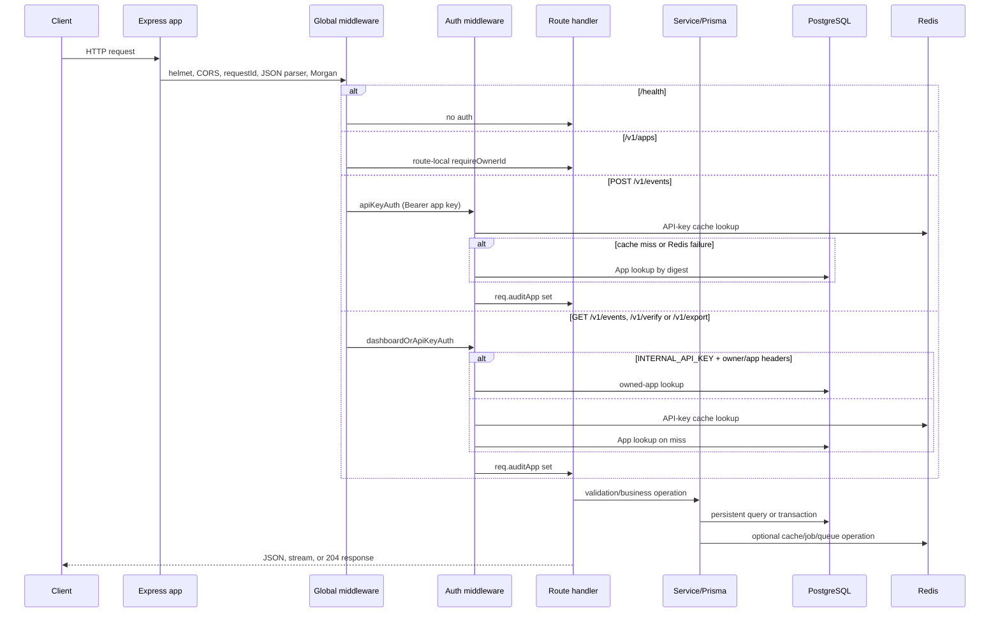
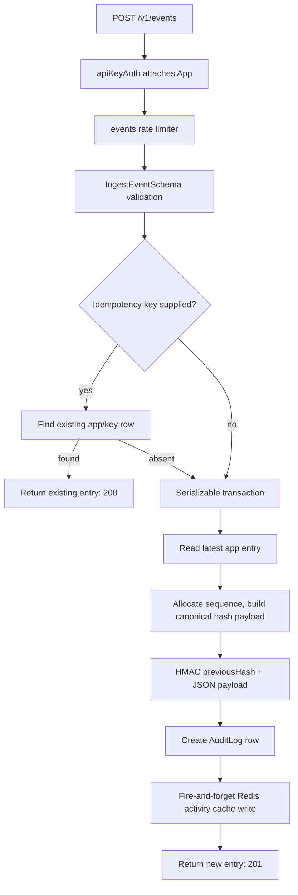

# Audit Log Service backend architecture

## Scope and source of truth

This document describes the current implementation: `src/` (Express API,
BullMQ queue, verification worker), the Prisma schema and migrations, the
Next.js dashboard's server-side security model, Docker Compose local
orchestration, and CI. The current source code is authoritative. Older notes
describing in-process `setImmediate` verification, a `User` table, or
`DASHBOARD_OWNER_ID` are obsolete and must not be treated as behavior.

## Project overview

The service accepts audit events from registered applications, stores them in
PostgreSQL, links each app's events into an HMAC-SHA256 hash chain, and exposes
search, export, resource activity, and durable on-demand chain-verification
APIs. It also manages application API keys through a separate
internal-dashboard API.

The backend owns HTTP handling, authentication, validation, sequence allocation,
hash-chain construction and verification, storage, Redis-backed temporary data,
email-alert attempts, request logging, and graceful shutdown. Route handlers
call Prisma and services directly; there is no separate controller layer and no
dependency-injection container.

The central domain concepts are:

| Concept | Current representation and role |
|---|---|
| Application | An `App` database row. It owns a per-app event chain and API key. `App.ownerId` is the GitHub user id (`token.sub`) from the dashboard NextAuth session. There is no `User` table. |
| API key | A raw `als_...` bearer credential returned once at creation/rotation; `App.apiKey` stores only its HMAC-SHA256 digest (`hashApiKey`, keyed by `HASH_SECRET`). |
| Audit event / log entry | An `AuditLog` row containing actor, action, resource, optional metadata/network fields, chain fields, and a per-app sequence number. |
| Genesis hash | `GENESIS_HASH`, used as `previousHash` for an app's first entry. |
| Hash chain | Each entry HMACs its defined payload together with its predecessor's hash. The next entry depends on the prior entry's stored hash. |
| Canonicalization | Recursive sorting of metadata object keys before metadata enters the hash payload. Arrays retain order; objects inside arrays are canonicalized. |
| Idempotency key | An optional client token stored on `AuditLog`. It scopes duplicate detection to one app via a unique `(appId, idempotencyKey)` constraint. |
| Verification job | A Redis JSON object (`verify-job:{appId}:{jobId}`) plus a BullMQ durable queue job (`verification` queue) consumed by a separate worker process. |
| Active-job sentinel | A Redis key (`verify-active:{appId}`) holding the owning `jobId`, acquired/released atomically via Lua. It prevents duplicate concurrent verifications per app. |

`ipAddress`, `userAgent`, and `idempotencyKey` are stored on an audit row but
are **not** fields of `HashPayload`. The HMAC verification logic therefore does
not itself detect changes to those three fields; the PostgreSQL append-only
trigger is the ordinary-write protection for the row as a whole. See
[DATA_STORAGE.md](DATA_STORAGE.md#integrity-and-physical-schema-state).

## Components and relationships

```mermaid
flowchart LR
  Client[API client] --> Express[Express app]
  Browser[Browser] --> Dashboard[Next.js dashboard]
  Dashboard --> Express
  Express --> Global[Helmet / CORS / request ID / JSON parser / Morgan]
  Global --> Apps[/v1/apps router]
  Global --> EventRoutes[/v1/events routers<br/>POST: apiKeyAuth only<br/>GET: dashboardOrApiKeyAuth]
  Global --> VerifyRoutes[/v1/verify router<br/>dashboardOrApiKeyAuth]
  Global --> ExportRoute[/v1/export router<br/>dashboardOrApiKeyAuth]
  Apps --> Prisma[Prisma client]
  EventRoutes --> Hash[hashChain service]
  EventRoutes --> Activity[activityCache service]
  VerifyRoutes --> Queue[BullMQ verification queue]
  Queue --> Worker[verification worker process]
  Worker --> Hash
  Worker --> Jobs[(Redis job state + sentinel)]
  Worker --> Alerts[alert service]
  VerifyRoutes --> Jobs
  EventRoutes --> ActivityCache[(Redis activity sets)]
  Express --> KeyCache[(Redis API-key cache)]
  Prisma --> Postgres[(PostgreSQL)]
  Alerts --> Brevo[Brevo HTTP API]
```

### Express application and route ownership

`createApp()` in `src/app.ts` constructs an Express application:

1. `/health` first (no authentication).
2. `/v1/apps` (dashboard-owner authorization via `INTERNAL_API_KEY`, route-local).
3. `/v1/events` behind two routers sharing the prefix, with the read router
   mounted first on purpose: `searchRouter` (`GET /`, `GET /activity/:resourceId`)
   behind `dashboardOrApiKeyAuth`, then `eventsRouter` (`POST /`) behind
   `apiKeyAuth`. Express executes each mount's auth middleware for every
   subpath, so a customer-only gate mounted first would reject dashboard reads
   before they reach the search router. `POST /` still falls through to
   `apiKeyAuth`, so customer write authentication is unchanged.
4. `/v1/verify` behind `dashboardOrApiKeyAuth`.
5. `/v1/export` behind `dashboardOrApiKeyAuth`.
6. Global JSON 404 handler, then `errorHandler`.

The app is exported for embedding; when `src/app.ts` is the main module it
validates required environment variables, listens on `PORT`, and installs
shutdown handlers. API shutdown closes the BullMQ queue handle (without
deleting queued jobs), disconnects Prisma and Redis, and exits.

The route modules use:

- `src/config/db.ts` for a singleton Prisma client.
- `src/config/redis.ts` for one ioredis client (the API process).
- `src/queues/verificationQueue.ts` for the BullMQ `verification` queue handle.
- services for hash chains, activity caching, alerts, verification-job
  state/sentinel, API-key hashing, and currently-unwired analytics functions.
- middleware for authentication, validation, rate limiting, async-error
  forwarding, request IDs, and final error formatting.

There is no controller directory and no dependency-injection container. The
durable job system is BullMQ on Redis plus the separate worker process
(`src/workers/verificationWorker.ts`, `npm run worker`).

## Request lifecycle



Global middleware executes in this exact order:

1. `helmet()` sets default security-oriented response headers.
2. `cors()` applies the configured origin list, methods, credentials setting,
   request headers (`Content-Type`, `Authorization`, `x-owner-id`, `x-user-id`,
   `x-app-id`, `x-request-id`), and exposed `x-request-id` header.
3. `requestId` adopts the first supplied `x-request-id` header value or creates
   a UUID, puts it on `req.id`, `req.requestId`, request headers, and response
   headers.
4. `express.json({ limit: '1mb' })` parses JSON bodies.
5. Morgan logs every route except `/health` through Winston (console transport,
   JSON format in current code).
6. Route mounting and per-route auth occur (see above).
7. A global 404 JSON handler runs for unmatched paths.
8. `errorHandler` formats forwarded route errors.

For details of each middleware, see [MIDDLEWARE.md](MIDDLEWARE.md).

## Data lifecycle

### Audit-log ingestion



`IngestEventSchema` validates actor, action, resource, optional metadata (object
only, 10 KB serialized cap), network fields, and optional idempotency key. A
request with a previously stored idempotency key returns the earlier row's
public ingestion response, regardless of whether the new request body differs.
No request-body equality comparison is implemented.

For a new entry, `createAuditLogEntry()` reads the latest row for the current
app inside a Serializable transaction. It uses the latest `entryHash`, or
`GENESIS_HASH` when no row exists, and increments the latest sequence number,
or starts at one. It creates the timestamp before hashing and writes the same
timestamp to the row. The HMAC input is `previousHash + JSON.stringify(payload)`.
The payload is constructed in a fixed property order. Metadata is recursively
canonicalized before it is placed in that payload.

The database's unique `(appId, idempotencyKey)` constraint resolves simultaneous
idempotent inserts. A `P2002` error with an idempotency key causes a lookup of
the winning row. Serializable `P2034` conflicts retry while fewer than three
attempts have occurred.

### Hash-chain verification (durable BullMQ worker)

```mermaid
sequenceDiagram
  participant C as Client
  participant R as verify router (API)
  participant D as Redis
  participant Q as BullMQ verification queue
  participant W as Worker process
  participant P as PostgreSQL
  participant B as Brevo

  C->>R: POST /v1/verify
  R->>D: Lua acquire verify-active:{appId}
  alt slot busy
    R-->>C: 409 JOB_IN_PROGRESS + pollUrl
  else slot acquired
    R->>D: SAVE pending/queued job (no TTL yet)
    R->>Q: ADD verify-chain {appId, jobId, appName}
    R-->>C: 202 jobId and poll URL
    Q->>W: deliver job (attempts 3, exponential backoff)
    W->>D: SAVE running + start heartbeat
    W->>P: Read AuditLog batches in sequence order
    W->>W: Rebuild payload and recompute each HMAC
    alt valid
      W->>D: SAVE complete result (TTL) + release sentinel
    else mismatch
      W->>D: SAVE complete invalid result (TTL) + release sentinel
      W->>B: Best-effort tamper alert
    else thrown error, retries remain
      W->>D: SAVE pending/retrying (no TTL), no release; rethrow
    else thrown error, retries exhausted
      W->>D: SAVE failed (TTL) + release sentinel; rethrow
    end
  end
  C->>R: GET /v1/verify/:jobId
  R->>D: GET app-scoped job key
  R-->>C: pending/running/complete/failed, or 404/500
```

Verification is durable, not in-process:

- `POST /v1/verify` atomically acquires the per-app sentinel with a Lua script,
  persists a `pending`/`queued` job, enqueues a BullMQ job, and returns 202. If
  the enqueue fails, it persists `failed`, releases the sentinel, and rethrows.
- Redis is the job-state store; BullMQ on Redis is the durable queue backend
  (default job options: `attempts: 3`, exponential backoff 500 ms,
  `removeOnComplete: true`, `removeOnFail: true` — BullMQ internals are removed
  after settlement; the observable `verify-job:*` record is retained with TTL).
- The separate worker process (`node dist/workers/verificationWorker.js`,
  `concurrency: 1`) consumes the queue, renews the sentinel via heartbeat while
  `verifyChain()` runs, updates the persisted lifecycle
  (`pending/queued` → `running` → `complete`, or `pending/retrying` between
  attempts, or `failed`), releases the sentinel on terminal states, and sends a
  best-effort tamper alert on an invalid result.
- Worker shutdown uses `worker.close()`; API shutdown closes only its local
  queue handle via `closeVerificationQueue()` and never deletes queued jobs.
- `verifyChain()` reads `VERIFY_CHAIN_BATCH_SIZE` rows at a time, ordered by
  `sequenceNumber` ascending. For each row it rebuilds the canonical payload,
  computes the expected entry HMAC from the prior stored hash, and timing-safely
  compares both the row's `previousHash` and `entryHash`. It returns at the first
  mismatch, otherwise a valid count and duration. A verification result of
  `valid: false` is a successful verification response, not an HTTP failure.

### Authentication and authorization

Customer API routes require an `Authorization: Bearer <raw-key>` header where
the raw key has the form `als_<64 hex chars>`. `apiKeyAuth` derives an
HMAC-SHA256 digest from the raw key using `HASH_SECRET` (`hashApiKey`), then
reads the Redis key `apikey:{digest}`. Cache entries contain only non-secret app
authorization data (`Omit<App, 'apiKey'>`). On a cache miss or Redis error it
queries an active `App` by digest in PostgreSQL. It assigns the result to
`req.auditApp`.

Dashboard/server-to-server access has two shapes:

- `/v1/apps` uses `getDashboardOwnerId()`: a valid `INTERNAL_API_KEY` Bearer
  token paired with `x-owner-id` or `x-user-id` yields the owner scope.
  `requireOwnerId()` throws 401 `DASHBOARD_AUTH_REQUIRED` when no owner can be
  derived. No app API key is accepted here.
- `/v1/verify`, `/v1/export`, and the read-only `GET /v1/events` routes
  (`searchRouter`: search and activity) use `dashboardOrApiKeyAuth`: if the
  request presents the valid `INTERNAL_API_KEY`, it must also supply
  `x-owner-id` **and** `x-app-id`; the handler looks up that active owned app
  (403 `DASHBOARD_AUTH_REQUIRED` when headers are missing, 403
  `APP_ACCESS_DENIED` when the app is not owned by that owner) and sets
  `req.auditApp`. Otherwise the request falls through to `apiKeyAuth`.
  `POST /v1/events` (ingestion) stays on `apiKeyAuth`, so customer write
  authentication is unchanged. `INTERNAL_API_KEY` is server-only
  (dashboard `lib/api.ts` is `server-only`); browser clients never receive it.

Dashboard pages and dashboard API proxy routes are additionally guarded by
NextAuth/GitHub sessions (`getServerSession`); unauthenticated callers are
redirected to `/login` or receive 401. The GitHub user id (`token.sub`,
exposed as `session.user.id`) is the `ownerId` sent in `x-owner-id`.

Dashboard app management (create, rotate, deactivate) goes through
session-guarded proxy routes (`dashboard/app/api/dashboard/apps/...`) that
validate UUIDs, derive ownership exclusively from the session via
`dashboardRequest`, and map backend errors to safe messages. The Overview and
Events pages resolve an explicit selected app from the owner's own app list
(`dashboard/lib/app-selection.ts`, `AppSelector.tsx`) and send it as
`x-app-id`; one owner can own many apps, so there is no unscoped
owner-wide event read. `dashboardFetch` throws on non-2xx instead of
returning null, so API failures surface as error cards rather than silent
empty data. Raw keys are shown once (`OneTimeKeyPanel`) and live only in
transient component state.

### Activity cache hit and miss

`GET /v1/events/activity/:resourceId` uses a Redis sorted set scoped by both
app ID and resource ID. On a nonempty cache response it parses each member and
returns `source: "cache"`. On an empty result or Redis error it reads matching
rows from PostgreSQL in reverse `createdAt` order, starts a non-awaited Redis
bulk warm, and returns `source: "database"`. Malformed cached members are
skipped; a nonempty Redis result containing only malformed values still reports
a cache source rather than forcing a database fallback.

## Background work and external runtime service

Background work consists of:

- Durable verification jobs consumed by the separate worker process.
- Fire-and-forget Redis activity-cache writes/warms on ingestion and
  activity-cache fallback.
- Best-effort Brevo SMTP alert after a tampered verification result.

`alertService` uses the global `fetch` API to call Brevo's SMTP endpoint. It
skips sending when any Brevo environment setting is missing, logs failed HTTP
statuses/errors, and does not retry. The anomaly-alert function exists but no
current code calls it. The analytics service (`analyticsService.ts`) is
implemented with a Redis cache-aside layer but no current backend route invokes
it.

## Error and failure behavior

| Situation | Current behavior |
|---|---|
| Schema/body/query validation | Validation middleware returns 400 `VALIDATION_ERROR`; route-local Zod errors reach `errorHandler`, which returns the same contract. |
| Missing/invalid per-app key | `apiKeyAuth` returns 401 `MISSING_API_KEY` or `INVALID_API_KEY`. |
| Missing dashboard owner headers on verify/export/events reads | `dashboardOrApiKeyAuth` returns 403 `DASHBOARD_AUTH_REQUIRED`. |
| Dashboard-owned app mismatch on verify/export/events reads | Returns 403 `APP_ACCESS_DENIED`. |
| Missing dashboard authorization on apps routes | `requireOwnerId()` throws `AppError`; the final handler returns 401 `DASHBOARD_AUTH_REQUIRED`. |
| Duplicate verification per app | `POST /v1/verify` returns 409 `JOB_IN_PROGRESS` with existing `jobId`/`pollUrl`; concurrent acquires are serialized by the Lua sentinel. |
| Verification enqueue failure | Persists `failed` job, releases the sentinel, and rethrows (generic 500). |
| Corrupt persisted verification state | Polling returns 500 `JOB_DATA_CORRUPT`. |
| Unknown/foreign verification job | Polling returns 404 `JOB_NOT_FOUND` (includes cross-app `appId` mismatch, which is also how dashboard app scoping is enforced on polls). |
| Rate limit | express-rate-limit returns its configured 429 JSON payload before the route handler. |
| Redis cache failure | API-key cache, activity cache, and analytics cache generally log and fall back or continue. Verification polling cannot recover a job that Redis did not store. |
| PostgreSQL failure in wrapped routes | `asyncHandler` forwards the rejection to `errorHandler`, normally yielding generic 500 unless it is an `AppError`. |
| Verification exception in worker | Worker persists `pending`/`retrying` (retries remain) or `failed` (exhausted), releases the sentinel only on terminal failure, and rethrows so BullMQ retries. The initiating HTTP response was already sent. |
| Dependency failure on `/health` | 503 `degraded` with generic `unavailable` per dependency; raw messages stay in server-side logs. |
| Unknown route | Global handler returns 404 `NOT_FOUND`. |
| Unexpected forwarded exception | `errorHandler` logs request/path/stack and sends generic 500. |

## Concurrency and consistency

The per-app hash chain is protected during insertion by a PostgreSQL Serializable
transaction plus a unique `(appId, sequenceNumber)` constraint. The transaction
reads the tail, derives the next sequence and predecessor hash, and inserts one
row. Serializable conflicts are retried (up to three attempts total). Different
app IDs use independent chains.

The idempotency pre-check is deliberately outside the transaction. It makes
ordinary sequential retries cheap; the database unique constraint resolves the
concurrent race. Redis activity writes use a pipeline, so their `ZADD`, trim,
and expiry commands are sent together, but cache writes are best-effort and do
not participate in the PostgreSQL transaction.

Verification concurrency is coordinated by the atomic Redis sentinel:

- Acquisition, ownership-checked release, and ownership-checked TTL renewal are
  single-round-trip Lua scripts, so two simultaneous `POST /v1/verify` calls for
  one app resolve to exactly one 202 and one 409.
- Sentinel ownership is the `jobId` value; release/renewal only act when the
  stored value still matches the caller, so a finishing job cannot release a
  newer job's slot.
- The worker heartbeat renews the sentinel (default every TTL/3, minimum 1 s)
  so long verifications do not lose the slot; terminal states release it, and a
  stale terminal reference is recoverable on the next acquire.

## Configuration map

Values are supplied by the process environment. Most constants are read at
module initialization, so changing the environment requires a process restart.
`validateEnv()` (`src/config/validateEnv.ts`, called by both the API and the
worker entrypoints) rejects missing required variables, malformed numerics
for every consumed numeric setting (ports 1–65535, counts/TTLs positive
integers; unset still means "use default"), malformed `DATABASE_URL`/
`CORS_ORIGINS`, and weak `HASH_SECRET`/`INTERNAL_API_KEY` under
`NODE_ENV=production` (warning only elsewhere, so compose defaults and CI
keep working).

| Variable | Required / default | Used by | Runtime effect |
|---|---|---|---|
| `PORT` | optional, `3000` | `app.ts` | Listening port when app is main module. |
| `DATABASE_URL` | required at direct server startup | Prisma | PostgreSQL connection string. |
| `REDIS_HOST` | required | Redis config, queue, worker | Redis host. |
| `REDIS_PORT` | required | Redis config, queue, worker | Redis port, parsed as an integer. |
| `REDIS_PASSWORD` | optional | Redis config, queue, worker | Redis password; empty is omitted. Queue/worker set `maxRetriesPerRequest: null` as BullMQ requires. |
| `HASH_SECRET` | required at direct server startup | hashChain, apiKey | HMAC key for chains and API-key digests. |
| `GENESIS_HASH` | required at direct server startup | hashChain | First-entry predecessor hash. |
| `INTERNAL_API_KEY` | required at direct server startup | dashboard auth | Bearer secret for `/v1/apps` and dashboard path of verify/export. |
| `CORS_ORIGINS` | required | app | Comma-separated allowed origins. |
| `NEXTAUTH_URL` / `NEXTAUTH_SECRET` / `GITHUB_*` | dashboard configuration | dashboard | GitHub OAuth via NextAuth. |
| `API_URL` | dashboard server configuration | dashboard `lib/api.ts` | Server-side backend base URL (never exposed to browsers). |
| `NEXT_PUBLIC_API_URL` | dashboard public configuration | dashboard URL builder | Public backend base URL for browser-built URLs. |
| `API_KEY_CACHE_TTL_SECONDS` | optional, `600` | auth | Redis API-key cache TTL. |
| `RATE_LIMIT_EVENTS_*` | `60000` / `200` | rate limiter | Event route window and maximum. |
| `RATE_LIMIT_VERIFY_*` | `300000` / `1` | rate limiter | Verification-start window and maximum. |
| `RATE_LIMIT_APPS_*` | `60000` / `30` | rate limiter | App mutation window and maximum. |
| `RATE_LIMIT_SEARCH_*` | `60000` / `100` | rate limiter | Search/activity window and maximum. |
| `RATE_LIMIT_EXPORT_*` | `60000` / `10` | rate limiter | Export window and maximum. |
| `ACTIVITY_CACHE_MAX_ENTRIES` | optional, `50` | activity cache | Per-resource sorted-set retention count. |
| `ACTIVITY_CACHE_TTL_SECONDS` | optional, `3600` | activity cache | Activity key expiry. |
| `VERIFY_CHAIN_BATCH_SIZE` | optional, `500` | hashChain | Rows fetched per verification query. |
| `VERIFY_JOB_TTL_SECONDS` | optional, `3600` | verification jobs | Redis verification-job expiry for terminal states. |
| `VERIFY_ACTIVE_TTL_SECONDS` | optional, `3600` | verification jobs | Sentinel TTL and heartbeat basis. |
| `JSON_EXPORT_MAX_ROWS` | optional, `10000` | export route | JSON-export cap. |
| `BREVO_API_KEY` | optional | alert service | Enables Brevo request when paired with addresses. |
| `ALERT_EMAIL_FROM` | optional | alert service | Alert sender address. |
| `ALERT_EMAIL_TO` | optional | alert service | Alert recipient address. |
| `ANALYTICS_*` | optional, see source defaults | analytics service | Cache TTL and aggregation windows for currently-unwired functions. |

## Design decisions evidenced by code

- **Append-only rows are enforced in PostgreSQL.** A migration installs a
  `BEFORE UPDATE OR DELETE` trigger, so normal application and SQL changes are
  rejected at the database layer.
- **Metadata is canonicalized before hashing.** This prevents object key order
  after JSONB round-tripping from changing an otherwise equivalent hash input.
- **Writes are Serializable.** The transaction prevents concurrent writers from
  producing inconsistent predecessor relationships for one app chain.
- **Idempotency is optional.** Existing clients can omit the field; callers that
  retry may supply it to receive the original entry instead of another insert.
- **Verification is durable and worker-owned.** The API persists job state and
  enqueues through BullMQ; a separate worker process performs the O(n) scan, so
  API restarts do not lose queued work and long scans do not block HTTP workers.
- **Redis is best-effort for cache and job state.** Most cache failures are
  logged rather than turning a data operation into an outage. Verification-job
  observability, however, depends on Redis persistence.

## Local infrastructure and deployment status

Local orchestration (`docker-compose.yml`) runs four services: `postgres` (15),
`redis` (7-alpine, append-only), `api` (production image, port 3000), and
`worker` (same production image, `node dist/workers/verificationWorker.js`).
Postgres and Redis have healthchecks; `api`/`worker` depend on them being
healthy. The production image is non-root (`USER node`), installs OpenSSL for
Prisma, and has a `/health` healthcheck.

Planned but not implemented as automation: Railway hosting for API/PostgreSQL/
Redis, Vercel hosting for the dashboard, and any deploy step in CI. CI runs a
backend job (generate, typecheck, lint, migrate, tests, build, diff-check) plus
an independent dashboard job (`npm ci`, typecheck, build with non-secret
deployment-shaped config). There is no AWS/Terraform/CD pipeline in the
current codebase.

For exact endpoint contracts see [ROUTES_AND_FLOW.md](ROUTES_AND_FLOW.md); for
storage layouts see [DATA_STORAGE.md](DATA_STORAGE.md); and for type-level
details see [TYPES_AND_INTERFACES.md](TYPES_AND_INTERFACES.md).
